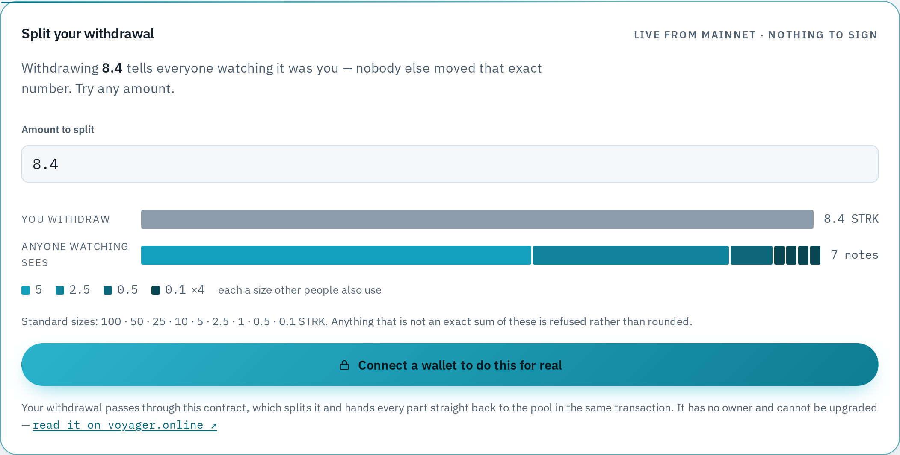
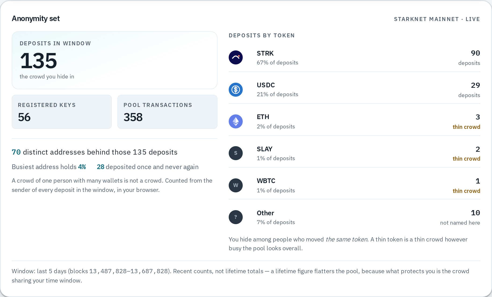
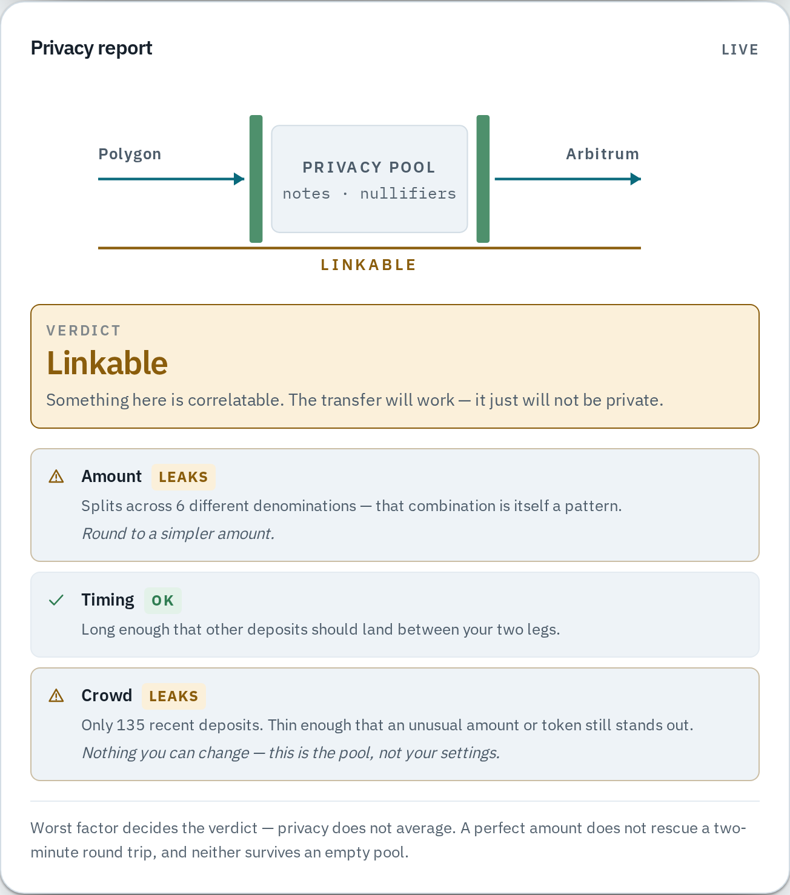
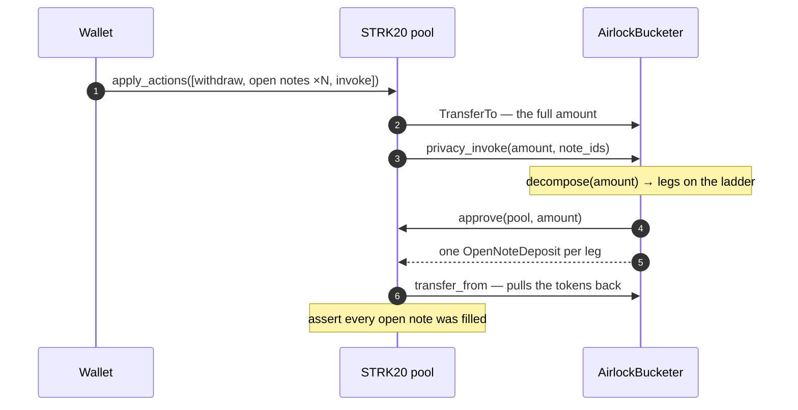

# Airlock

**One-click privacy from any chain.** Step in on one chain, the door seals behind you, step out on another. No on-chain link between the two sides.

Built on the [STRK20](https://strk20-by-example.org/what-is-strk20) privacy pool for the [Private Sprint](https://github.com/starkience/strk20-hackathon) — [RFP-09, cross-chain privacy hub](https://strk20.starknet.io/rfp/cross-chain-privacy-hub).

**[Try it → kenkomu.github.io/airlock](https://kenkomu.github.io/airlock/)** — no install, and no wallet needed to look. The anonymity panel reads the live mainnet pool the moment the page loads.

---



Type an amount and the deployed mainnet contract answers. No wallet, no
signature — `plan` is a view function, so the split you see is the split that
would happen.

---

## What runs today

The honest answer to "can I use this". Deliberately placed before the design, so nobody has to read a plan to find out what is real.

| | |
|---|---|
| ✅ | **Live demo**, deployed from `main` on every push and gated on the test suite |
| ✅ | **`AirlockBucketer` anonymizer in Cairo** — denomination bucketing, the mitigation StarkWare's own threat model defers ([docs/anonymizer.md](docs/anonymizer.md)) |
| ✅ | **Deployed to mainnet** — bucketers for [STRK](https://voyager.online/contract/0x036816fe3c38b222e737ec4168b604309ab24154862d1a3f4c9db0042a90e97a) and [USDC](https://voyager.online/contract/0x06c63f43ddfa18ce3e4b39ea4fae212cc65308ba181603d98fb5d5ee4a978643), constructor values re-read from chain after deploy |
| ✅ | **Deployed to Sepolia** — two bucketers, STRK and USDC, both verified against chain |
| ✅ | **The real pool calls it** — the deployed Sepolia pool runs its real entry point against our deployed contract ([below](#the-pool-really-does-call-it)) |
| ✅ | Anonymity-set and timing disclosure, read live from the mainnet pool — no wallet required |
| ✅ | Connect a privacy-enabled Starknet wallet and read a shielded balance (`WalletAccountV6`, `strk20Balances`) |
| ✅ | Split a shielded balance into standard note sizes, with the split read from the contract rather than computed in the client |
| ✅ | **Per-rung crowd measurement** — how many people have actually used each note size, counted live from the pool's own events, with the rarest leg named ([docs/anonymizer.md](docs/anonymizer.md)) |
| ✅ | **Four real mainnet round trips** through the anonymizer — amounts, splits, fees and verification in [docs/mainnet-runs.md](docs/mainnet-runs.md) |
| ✅ | **Connect from a chain that is not Starknet** — one MetaMask signature derives a Starknet account and viewing key, no Starknet wallet required ([`identity.ts`](app/src/lib/identity.ts)) |
| 🟡 | **Bridge in over CCTP** — deploy, register and deposit run from one press, funded out of the USDC being moved. Built, but **not yet run against a real chain**; treat as unproven until a transfer has landed |
| 🟡 | **Withdraw to a different chain** — burn on Starknet, Circle attests, USDC mints at an address you name. Built; **not yet run against a real chain** |

**49 Cairo tests** (39 offline, 10 against a forked chain) and **151 TypeScript tests**, run on every push.

## Why this exists

**Mission — tell people the truth about how private they actually are, and then
make them more private than they were.**

Every privacy tool says it makes you private. Almost none will tell you when it
has failed to. That gap is where people get hurt: they take the claim at face
value, move money in a way that identifies them, and find out afterwards. Airlock
measures the thing it is selling and reports the answer even when the answer is
bad — including about itself.

**Vision — "private" should be a number you can check, not a word in a pitch.**

A privacy tool ought to be judged on what it measures and discloses, not on what
it asserts. That means publishing the size *and the shape* of the crowd you are
hiding in, naming the leaks it cannot close, and being verifiable by someone who
does not trust the people who built it.

### What that means in practice

These are not aspirations. Each one is a decision already made in this
repository, and the place to check it:

| | |
|---|---|
| **Name the leak** | The privacy report says **Linkable** about Airlock's own output when the crowd is thin. The verdict is the worst factor, never an average — a good amount does not rescue a two-minute round trip ([`exposure.ts`](app/src/lib/exposure.ts)) |
| **Measure, do not assert** | "135 deposits" can be one bot with 135 wallets. Airlock resolves the sender of every deposit and reports the concentration, and counts how many *people* — not notes — have used each denomination ([`pool.ts`](app/src/lib/pool.ts)) |
| **Fail closed** | An amount that is not an exact sum of the ladder reverts. It is never quietly rounded, because a remainder the user cannot see is worse than a refusal they can ([`bucketer.cairo`](src/bucketer.cairo)) |
| **Hold no privileged position** | No owner, no admin key, no upgrade path, no mutable storage. The account that deployed the contract can do nothing the public cannot ([docs/anonymizer.md](docs/anonymizer.md)) |
| **Say it where it is read** | Caveats sit at the moment of action, not in a footnote — the weaker of the two connection paths carries its warning on the screen where you choose it, while your wallet prompt is open |
| **Do not overclaim, in either direction** | Cross-chain deposits are built but have never run against a real chain, and the interface says exactly that. Understating working features is also a form of lying |

The last one is the one that costs something, and it cuts both ways. It would be
easy to describe this as a finished cross-chain privacy hub — both legs of the
round trip are written and the interface is complete. The honest description is
that no transfer has yet moved real money through either of them, and that is
the description on this page until one has.

## What is and isn't private

Being precise here matters more than it sounds. Overclaiming is how privacy tools mislead the people who most need them to work.

| Public | Private |
|---|---|
| The deposit leg: source address, token, amount | Movement inside the pool: parties, amounts, token |
| The withdrawal leg: destination address, token, amount | Which deposit a given withdrawal came from |
| That an address interacted with the pool, and when | Which notes were spent (nullifiers are unlinkable without the viewing key) |

**Airlock claims one thing: that the deposit side and the withdrawal side are not linkable on-chain.** It does not hide that you used a privacy pool, and it does not hide the amounts at the edges.

Shielding is not private either — *what you do afterwards* is. The auditor holds an escrowed viewing key and can de-anonymize the Starknet side. That is a tradeoff STRK20 makes deliberately, and it is why this is a privacy tool rather than a mixer.

### The timing caveat, stated plainly

The protocol's own documentation names rapid in-and-out sequences as a real weakness: opening a channel and withdrawing in tight succession can link a recipient to their public activity, and distinctive amounts moved quickly weaken the anonymity set.

So a two-minute round trip is **not** as private as the interface would like to imply. Airlock treats the dwell time between entering and leaving as part of the product rather than as latency: before you withdraw, it shows the current anonymity set and flags the timing and amount patterns that would make your two sides correlatable. A tool that lets you leave immediately while telling you it's private is worse than no tool.



Every figure there is counted in the browser from `starknet_getEvents` against
the mainnet pool. Reload it and the numbers move, because the pool does.

**The second column is the part no other privacy tool shows.** Everyone
publishes the *size* of an anonymity set; size cannot tell you whether 135
deposits are 70 people or one bot with 135 wallets, and those are very different
places to hide. Airlock resolves the sender of every deposit in the window and
reports the concentration — 70 distinct addresses, the busiest holding 4%, 28
that deposited once and never again.

The panel is also honest about its own limits. It counts a recent window rather than lifetime totals — a lifetime figure flatters the pool, because what protects you is the crowd sharing your *time window* and your *token*. Deposits of tokens it cannot name are counted and shown as `Other` rather than dropped, so the rows always add up to the headline.



The verdict is the worst factor, never an average — a perfect amount does not
rescue a two-minute round trip, and neither survives an empty pool. That rule
has [its own test suite](app/src/lib/__tests__/exposure.test.ts), including a
sweep asserting nothing is ever reported as sealed while any factor leaks.

## The problem

> "I have 10 ETH on Arbitrum. I want to send 5 ETH to a fresh address without anyone linking the two."

Most crypto users are not on Starknet, and shouldn't have to be. Airlock lets someone connect the wallet they already have, move value into the STRK20 privacy pool, hold it privately, and withdraw to a **different chain** — without installing a Starknet wallet, holding STRK, or thinking about Starknet at all. Starknet is the engine, not the destination.

The name is the mechanism. You enter, the door seals, a different door opens elsewhere. There is no moment when both doors are open at once.

## How the anonymizer works

A withdrawal that carries your exact amount is self-identifying. Withdraw `847.32 USDC` and anyone watching the pool can match it to the deposit of `847.32 USDC` that went in an hour earlier — the pool hid the link, and the amount handed it straight back.

`AirlockBucketer` splits a withdrawal into standard denominations, so no single note carries a distinctive number. The ladder is `1000 · 500 · 250 · 100 · 50 · 25 · 10 · 5 · 1`, multiplied by a `unit` fixed at deployment.



Three properties make this safe to hand a pool:

- **The amount is declared, never inferred.** Reading `balance_of` would let anyone grief the contract by sending it one unit of dust: the decomposition would shift, the leg count would stop matching the notes the client created, and every transaction would revert until someone cleared the dust. Declaring the amount makes the split a pure function of the call, and a stray balance is inert.
- **It fails closed.** An amount that is not an exact sum of denominations reverts, rather than silently leaving a remainder somewhere the user cannot see.
- **Nothing is mutable.** Pool, token and ladder are constructor arguments with no setters, and there is no owner, no admin key and no upgrade path. The account that deploys it holds no privileged position afterwards.

The client never computes the split it displays. It calls `plan(amount)` on the deployed contract and renders the answer, so the interface can never show a decomposition the contract would not produce. A parity suite pins the two together: the Cairo fixture table and the TypeScript one encode the same decomposition, and changing one without the other fails CI.

### The pool really does call it

Every cycle test in this project used to run against a `MockPool` written by reading the pool's source. That is worth a lot, but it shares an author with the contract under test, so it cannot disprove a misreading.

The gap looked unclosable without a wallet: the pool's entry point sits behind a STARK proof no fork can produce. That turned out to be wrong. `Privacy::validate_proof` does not verify a proof — it reads `tx_info.proof_facts`, a transaction-level field the sequencer populates and the contract trusts, and asserts five properties of it. `snforge` can set that field.

So [`src/tests/pool_fork_tests.cairo`](src/tests/pool_fork_tests.cairo) forks Sepolia and has the **deployed pool** run its **real entry point** against the **deployed bucketer**: it transfers 8.4 STRK in, calls `privacy_invoke`, deserializes what comes back as `Span<OpenNoteDeposit>`, pulls the tokens through our approval, and enforces its own open-note accounting. The notes are then read straight out of the pool's storage and checked to hold `5 + 2.5 + 0.5 + 0.1×4`.

Each test was falsified before it was kept — shortening the note list by one fails `LEG_COUNT_MISMATCH`, and a note that nothing fills fails the pool's own `UNDEPOSITED_OPEN_NOTES`.

**What this still does not cover:** the wallet, which is what translates an `STRK20_ACTION[]` into the pool's `Span<ServerAction>`. That translation is assumed here. A real round trip is the only thing that closes it.

## Design

The protocol constrains this more than it first appears, and the architecture follows from those constraints rather than from preference.

| Constraint | Consequence |
|---|---|
| You cannot register a viewing key on another user's behalf | A Starknet account is derived deterministically from the signature the user gives on their own chain, and registers itself |
| At most one `InvokeExternal` per pool transaction | The round trip cannot be atomic; it is a resumable multi-transaction job with off-chain orchestration |
| Deposits are screened on-chain by the protocol | Screening rejection is a first-class user-facing state, not an error toast |
| One anonymizer serves one token, on one pool, with one ladder | "The bucketer" is a property of a (network, token) pair, never of a network |

**Stack**

| Layer | Choice |
|---|---|
| Pool actions from the app | [Starknet Wallet API](https://strk20-by-example.org/starknet-wallet-api/overview) via `starknet.js` `WalletAccountV6` — the wallet holds the viewing key and does the proving; this app never sees either |
| Denomination bucketing | An app-specific [`privacy_invoke`](https://strk20-by-example.org/helpers/privacy-invoke) anonymizer in Cairo |
| Cross-chain value movement | [`privacy-bridge`](https://github.com/starkware-libs/privacy-bridge) over Circle CCTP — *not yet wired* |

## Scope

Deliberately one lane, taken all the way to mainnet, rather than four half-finished ones.

**In:** the STRK20 pool on Starknet, denomination bucketing, timing and anonymity-set disclosure, and one EVM source chain for the cross-chain leg.

**Out for now:** Solana, arbitrary ERC-20s, StarkGate/LayerSwap/Orbiter wrappers, and anything requiring sub-accounts or confidential compute.

## Running locally

The app is a Vite + React client with no backend. Node is pinned by [`app/.nvmrc`](app/.nvmrc) and dependencies by the lockfile — install from the lockfile rather than by name, since STRK20 support landed in `starknet` 10.4.0 and a loose resolve gets you a version with none of the API.

```bash
nvm use                          # 20.19.0, from app/.nvmrc
cd app
pnpm install --frozen-lockfile
pnpm dev
```

To actually use it you need a privacy-enabled Starknet wallet — [Ready](https://www.ready.co/) **5.33.8 or newer**. The app probes for STRK20 support when you connect and names the version it found, rather than failing silently.

The contracts need [Scarb](https://docs.swmansion.com/scarb/) 2.19.1 and [Starknet Foundry](https://foundry-rs.github.io/starknet-foundry/) 0.62.1:

```bash
snforge test --skip fork_tests   # 39 offline tests, no network
snforge test fork_tests          # 10 tests against a pinned Sepolia fork
```

Fork tests are excluded from CI on purpose: they need network access and a public RPC, neither of which belongs in a pipeline whose job is to say whether the code is correct.

## Deployments

| | |
|---|---|
| Mainnet pool | [`0x040337b1…812a`](https://voyager.online/contract/0x040337b1af3c663e86e333bab5a4b28da8d4652a15a69beee2b677776ffe812a) |
| Sepolia pool | [`0x0254a6b2…0d91`](https://sepolia.voyager.online/contract/0x254a6b2997ef52e9f830ce1f543f6b29768295e8d17e2267d672c552cfe0d91) |
| Bucketer — Sepolia STRK, 0.1 rungs | [`0x00de39f7…0e6b`](https://sepolia.voyager.online/contract/0x00de39f79e7e8b0dcdafe955330e206990203d6047a22e853eab9df83c440e6b) |
| Bucketer — Sepolia USDC, 1.0 rungs | [`0x004c368a…b1fb`](https://sepolia.voyager.online/contract/0x004c368ae058ee81b61884c5c47ee57484c4348669b66ac606366bbd1fd1b1fb) |
| Bucketer — mainnet STRK, 0.1 rungs | [`0x036816fe…e97a`](https://voyager.online/contract/0x036816fe3c38b222e737ec4168b604309ab24154862d1a3f4c9db0042a90e97a) |
| Bucketer — mainnet USDC, 1.0 rungs | [`0x06c63f43…8643`](https://voyager.online/contract/0x06c63f43ddfa18ce3e4b39ea4fae212cc65308ba181603d98fb5d5ee4a978643) |

Addresses are also machine-readable in [`strk20.json`](strk20.json). Deploying is scripted, with a preflight that re-checks both constructor addresses are live contracts before anything is spent — see [docs/deploy.md](docs/deploy.md).

## Documentation

- [docs/anonymizer.md](docs/anonymizer.md) — the contract, its ladder, and the threat it addresses
- [docs/deploy.md](docs/deploy.md) — deploying a bucketer, and the preflight
- [docs/mainnet.md](docs/mainnet.md) — mainnet addresses and how they were verified
- [docs/mainnet-runs.md](docs/mainnet-runs.md) — every mainnet transaction, what it did, and how to check it
- [docs/setup.md](docs/setup.md) — toolchain versions and why each is pinned

## References

- [STRK20 by example](https://strk20-by-example.org/what-is-strk20) — the pool, notes and nullifiers, viewing keys, anonymizer contracts
- [starknet-privacy](https://github.com/starkware-libs/starknet-privacy) — pool contracts, TypeScript SDK, proving service
- [privacy-bridge](https://github.com/starkware-libs/privacy-bridge) — EVM ↔ pool value movement over CCTP
- [Awesome STRK20](https://github.com/Akashneelesh/awesome-strk20) — SDKs, helper contracts, proof-of-concept apps

## License

MIT
